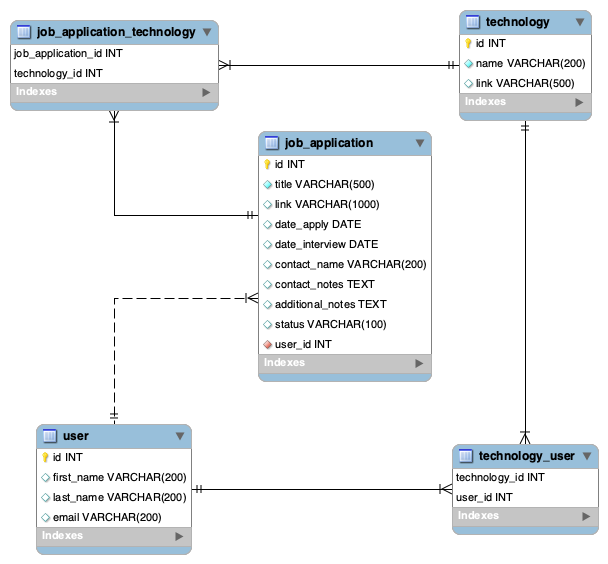

## EVENT TRACKER / JOB TRACKER

*** Oct 7 2019 Version 1.1

*** Refactored for Homework Week 13
-added javascript/html frontend.
*** Links are for previous version/ Version 1.1 available on GitHub

Skill Distillery Homework Week 12

This application uses basic REST API services. I chose to track job applications which is what I'll be doing after attending this school.

## Contents :
1. [Application URL](#application-url)
2. [How to Use the Application](#how-to-use-the-application)
3. [Technologies Used](#technologies-used)

## Application URL
http://34.218.203.197:8080/JobTracker/api/users

## How to Use the application

This application's GET/DELETE operations can be accessed using these URL's and the Json POST/PUT operations can be used on Postman.

### !! Change id #'s  and keywords as needed on example URL!!
* GET / find applications by keyword http://34.218.203.197:8080/JobTracker/api/applications/search/java

* GET / show all applications http://34.218.203.197:8080/JobTracker/api/applications
* GET / show all applications from user id
http://34.218.203.197:8080/JobTracker/api/applications/1  <-- (example id# (1))
* POST / add application to user by id http://34.218.203.197:8080/JobTracker/api/applications/1

* PUT / update application on user by id with application id
http://34.218.203.197:8080/JobTracker/api/1/applications/9  <-- (example id# (1) & (9))

* DELETE / delete application on user by id with application id http://34.218.203.197:8080/JobTracker/api/1/applications/9

* GET / show all users http://34.218.203.197:8080/JobTracker/api/users

* GET / find user by id http://34.218.203.197:8080/JobTracker/api/users/1

* GET / find users by cohort http://34.218.203.197:8080/JobTracker/api/users/search/SD22

* POST / create user http://34.218.203.197:8080/JobTracker/api/users/create

* PUT / update user by id http://34.218.203.197:8080/JobTracker/api/users/1

* DELETE / delete user by id http://34.218.203.197:8080/JobTracker/api/users/1

* GET / show all technologies http://34.218.203.197:8080/JobTracker/api/technologies

* GET / find technology by id http://34.218.203.197:8080/JobTracker/api/technologies/1

* POST / create technology http://34.218.203.197:8080/JobTracker/api/technologies/create

* PUT / update technology http://34.218.203.197:8080/JobTracker/api/technologies/1

* DELETE / delete technology http://34.218.203.197:8080/JobTracker/api/technologies/1

## Technologies Used

* Spring REST web services
* AJAX
* Java
* JPA
* JDBC
* MySQL
* GitHub
* AWS / EC2
* Postman
* JUnit
